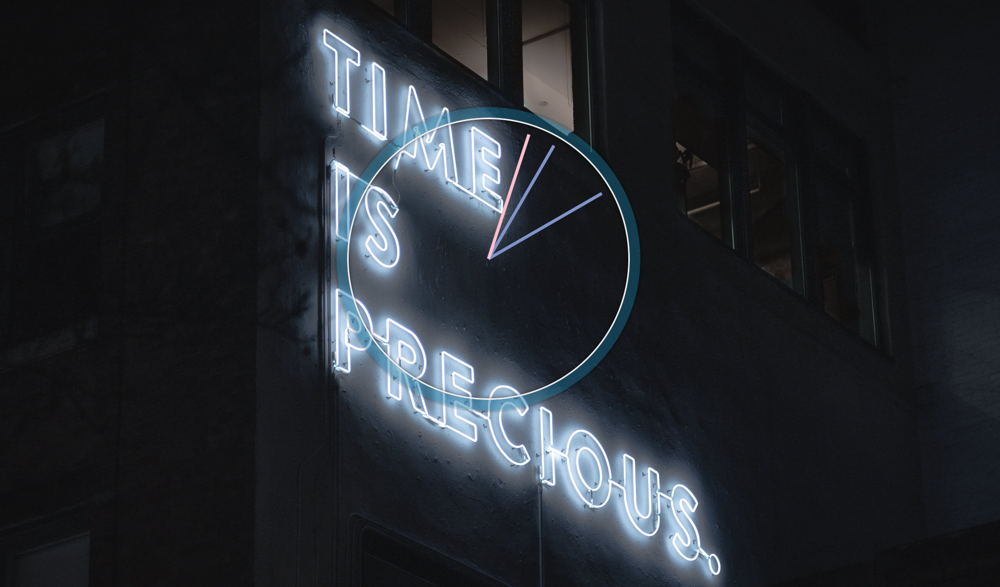

Welcome! 

Come join me on my journey of Wes Bos's 30 Day Vanilla JS Code Challenge! Where I build 30 things in 30 days with 30 tuturials~
  
### Day 2 Challenge of Javascript30

## Javascript & CSS Clock
----

Demo: 

I changed the background and colouring of the clock and clocks hands so it stands out =)

----
### What I learned/refresher:
- transform-origin
  - CSS attribute can be used to determine where a given transform 'pivots from.
- transition-timing-function
  - adding custom transition effect
- setInterval
  - perform a function at a given interval
- Date object / Date.now()
  - use instances .getSeconds/.getMinutes/.getHours and calculated the corresponding degree based off the time
- style

Starter code from [Javascript 30 Challenge](https://github.com/wesbos/JavaScript30)